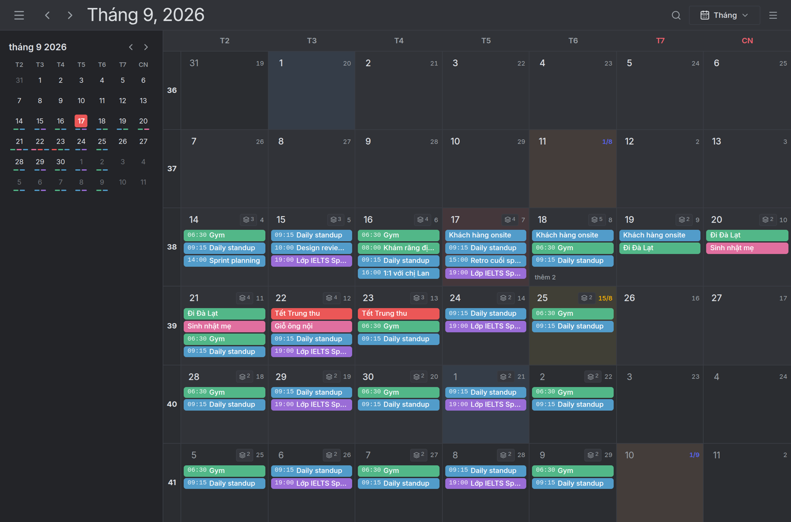
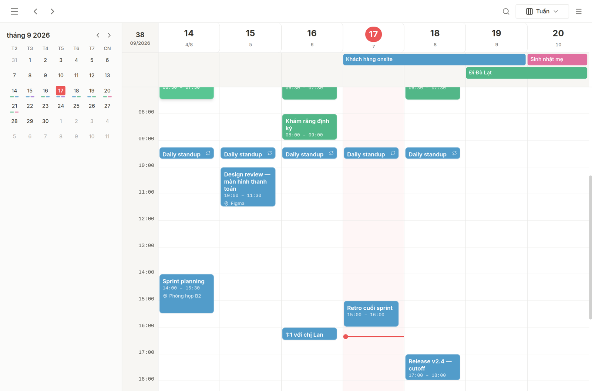
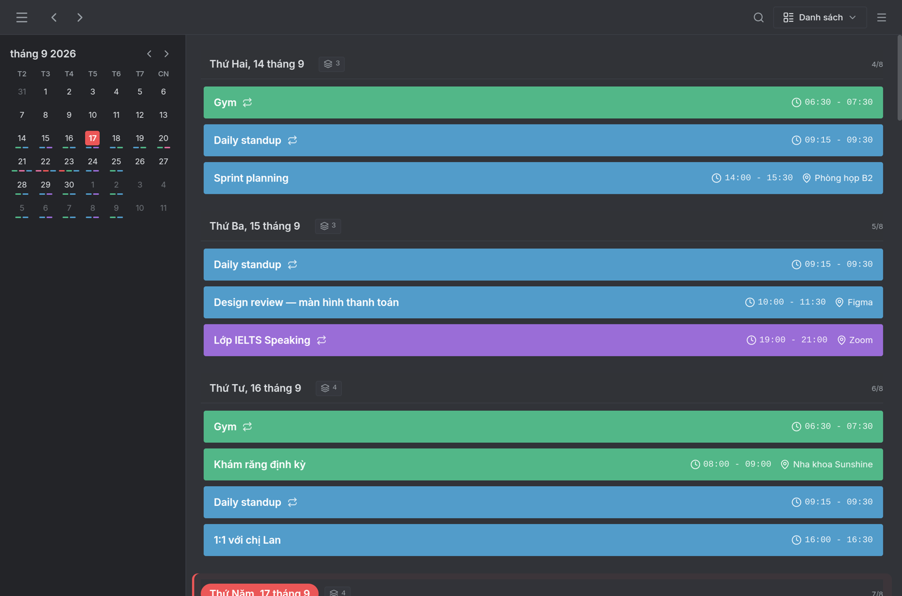
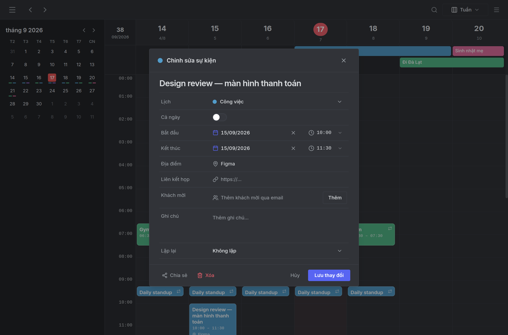
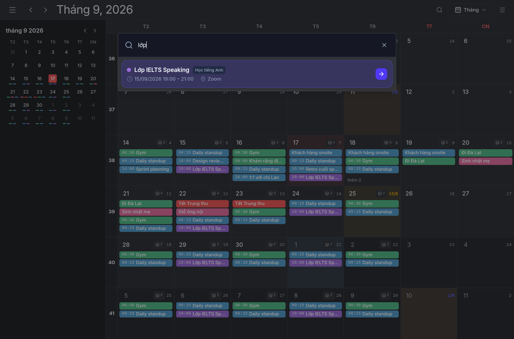
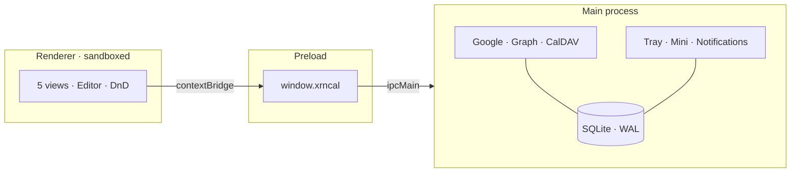

<p align="center">
  
</p>

<h1 align="center">xrncal</h1>

<p align="center">
  <strong>A local-first desktop calendar for Windows and Linux.</strong><br>
  Google, Microsoft 365 and CalDAV in one window — with <em>Vietnamese lunar dates</em> and <em>lunar-year anniversaries</em>.
</p>

<p align="center">
  
  
  
  
  
  
</p>

<p align="center">
  
</p>

<p align="center">
  <strong>English</strong> · <a href="README.vi.md">Tiếng Việt</a>
</p>

<p align="center">
  <a href="#why-not-just-use-your-existing-calendar">Why this?</a> ·
  <a href="#screenshots">Screenshots</a> ·
  <a href="#install">Install</a> ·
  <a href="#features">Features</a> ·
  <a href="#architecture">Architecture</a> ·
  <a href="#development">Development</a>
</p>

---

## Why not just use your existing calendar

Most calendar apps are **a client for one service**, or **a web tab in a wrapper**. xrncal works the other way round: your data lives in SQLite on your machine, and providers are just somewhere to push it to and pull it from.

### 1. The lunar calendar is a first-class citizen, not a plugin

This is the reason the app exists.

- Lunar day labels appear in **every view** — month cells, week headers, list groups. The first day of a lunar month is marked separately.
- **Giỗ / anniversaries that repeat by the lunar year** are a real event type. You declare *"the 12th day of the 8th lunar month"* and the app resolves the Gregorian date for **each year**, handling leap months and short 29-day months.
- Google Calendar, Outlook and Apple Calendar have no lunar recurrence rule at all. There, the only option is to look each year up and create it by hand — miss one and the whole series drifts.
- Those anniversaries are **materialised** into an ordinary event in a synced calendar, so your phone and your colleagues still see them even though they don't run xrncal.

### 2. Offline is the default, not a degraded mode

SQLite is the **source of truth for the UI**. With no network you can still browse, create, edit and delete; changes are marked `dirty = 1` and pushed when you are back online. There is no "cannot connect" screen.

### 3. Three providers, one window, no favourites

Google Calendar, Microsoft 365 / Outlook.com and CalDAV (Nextcloud, Synology, generic) sync **side by side**, each engine with its own `.catch` — one broken provider cannot block or cancel the other two.

### 4. Conflicts are surfaced, not silently overwritten

Every update and delete carries an `If-Match` precondition. A `412` means the server-side copy has moved on: that row is flagged as conflicted, **taken out of the push queue**, and shown to you to resolve — instead of retrying and re-failing forever, or quietly overwriting somebody else's change.

### 5. Tokens live in the OS secret store, and fail closed

OAuth tokens and CalDAV passwords are encrypted with Electron `safeStorage`. On a Linux box with no keyring available, the app **refuses to persist them** and says so plainly — there is no plaintext fallback. No telemetry, no xrncal account, no server in the middle.

### 6. Hand-built views with real direct manipulation

All five views are React components written for this app, with no third-party calendar library: drag and drop, edge resize, drag-select a time range, and a snap step (15 / 30 / 60 minutes) you set in Settings. Dropping onto another calendar asks *move or copy* — and only asks when the drop is genuinely ambiguous.

|  | A typical calendar app | xrncal |
| --- | --- | --- |
| Lunar dates | Absent, or a secondary label | In every view, plus lunar-year recurrence |
| Your data | On the provider's servers | SQLite on your machine |
| Offline | Mostly read-only | Full read, write, edit, delete |
| Multiple accounts | One app or tab per service | Google + Graph + CalDAV together |
| Sync conflicts | Usually a silent last-write-wins | `If-Match` → 412 flagged → you decide |
| Read-only calendars | Blocked in the UI | Blocked in the repo layer, unbypassable |

---

## Screenshots

<table>
<tr>
<td width="50%" valign="top">

<p align="center"><sub><strong>Week</strong> — light theme, week-number column, current-time line</sub></p>
</td>
<td width="50%" valign="top">

<p align="center"><sub><strong>List</strong> — grouped by day, lunar date on the right</sub></p>
</td>
</tr>
<tr>
<td width="50%" valign="top">

<p align="center"><sub><strong>Editor</strong> — calendar, all-day, location, meeting link, guests, recurrence</sub></p>
</td>
<td width="50%" valign="top">

<p align="center"><sub><strong>Search</strong> — FTS5, Vietnamese diacritics, opens with <code>/</code></sub></p>
</td>
</tr>
</table>

<sub>Captured from a real build running on sample data. The UI ships in both Vietnamese and English.</sub>

---

## Install

To build you need **Node.js 20+** and Git. There are no prebuilt releases yet — build from source.

```bash
git clone https://github.com/Xernnn/xrncal-desktop.git
cd xrncal-desktop
npm install
```

### Linux — install it as a real app in your menu

```bash
npm run app:install
```

This builds the AppImage, puts it at `~/Applications/xrncal.AppImage`, writes a launcher to `~/.local/share/applications/xrncal.desktop` and refreshes the menu. Look for "xrncal" in your app list. Re-run the same command to update: it overwrites the same paths, and it writes by `rename`, so it **cannot corrupt a running app** (an open window keeps the build it started on until you quit and reopen it).

If you would rather hold the AppImage yourself:

```bash
npm run pack:linux     # -> dist/*.AppImage
chmod +x dist/xrncal-*.AppImage
./dist/xrncal-*.AppImage
```

### Windows

```bash
npm run pack:win       # -> dist/  (NSIS installer, x64)
```

Run the `.exe` in `dist/` to install. There is no macOS build.

### Run it straight from source

```bash
npm run dev            # electron-vite, renderer hot reload
```

### Connecting accounts

CalDAV (Nextcloud, Synology, …) needs nothing but a URL and your credentials.

Google and Microsoft need **your own** OAuth client — no client secret is bundled with the app. Copy [`.env.example`](.env.example) to `.env` and fill in:

```ini
GOOGLE_OAUTH_CLIENT_ID=
GOOGLE_OAUTH_CLIENT_SECRET=
MICROSOFT_CLIENT_ID=
MICROSOFT_CLIENT_SECRET=
```

For a packaged build, put the same lines in `xrncal.env` inside the data directory (below). Until they are set, the Google and Microsoft connect buttons stay disabled and the app runs fully local — that is the intended behaviour, not a bug. Registering the OAuth clients: [`docs/deployment-guide.md`](docs/deployment-guide.md).

### Where your data lives

| OS | Path |
| --- | --- |
| Linux | `~/.config/xrncal/xrncal.sqlite` |
| Windows | `%APPDATA%\xrncal\xrncal.sqlite` |

Back it up at any time from **Settings → Back up database**, which writes a plain `.sqlite` file any SQLite tool can open.

> Upgrading from the old **Gone Calendar** build: the first launch of xrncal copies your data across automatically. The old profile is left exactly where it was.

---

## Features

<table>
<tr>
<td width="50%" valign="top">

**Calendar**
- Five views: Day, Week, Month, Year, List
- Drag and drop, edge resize, drag-select a range
- Snap step of 15 / 30 / 60 minutes
- Recurring edits: this one / this and future / all
- Multi-day and all-day events, ISO week numbers
- A second timezone gutter for cross-border schedules

</td>
<td width="50%" valign="top">

**Vietnam & languages**
- Lunar dates in Month / Week / List
- Anniversaries recurring by lunar year, leap months handled
- Vietnamese and international holiday calendars, one click
- Interface in Vietnamese and English

</td>
</tr>
<tr>
<td width="50%" valign="top">

**Sync**
- Google Calendar (OAuth loopback + PKCE)
- Microsoft 365 / Outlook.com (Graph)
- CalDAV: Nextcloud, Synology, generic
- Single-occurrence edits push correctly too
- Adaptive polling: 20s while focused, 5m in the tray
- A resolution screen for 412 conflicts

</td>
<td width="50%" valign="top">

**Workspace**
- Always-on-top mini window from the tray
- Reminder notifications (Windows / Linux)
- Light / dark / system theme, custom wallpaper
- FTS5 search, title suggestions from your own history
- `.ics` import and export, database backup
- Detach a provider and keep every event it brought

</td>
</tr>
</table>

### Keyboard shortcuts

| Key | Action |
| --- | --- |
| `T` | Jump to today |
| `1` `2` `3` `4` `5` | Day · Week · Month · Year · List |
| `N` or `C` | New event |
| `Ctrl+K` or `/` | Search |
| `?` or `F1` | Shortcut reference |

---

## Architecture



| Layer | Directory | Responsibility |
| --- | --- | --- |
| Renderer | `src/renderer` | React 19, five views, editor, i18n, theming |
| Preload | `src/preload` | Typed `window.xrncal`, sandbox on |
| Main | `src/main` | SQLite, OAuth, sync, tray, notifications |
| Shared | `src/shared` | `CalendarEvent`, `XrncalAPI`, lunar calendar, holidays |

The renderer **never** imports `src/main`; IPC is the only bridge, and every channel is declared in one place, `src/shared/ipc-contract.ts`. Read-only calendars (holiday subscriptions) are rejected in the repo layer rather than the UI, so no code path can write to them.

---

## Development

```bash
npm run dev            # run the app with renderer hot reload
npm run typecheck      # tsc for main + renderer (run before committing)
npm run lint           # ESLint 9 flat config
npm run test           # Vitest — runs in Node, no Electron binary needed
npm run build          # production bundle -> out/
```

Run a single test file: `npx vitest run tests/expand-occurrences.test.ts`. CI runs lint + typecheck + test + build on every push and pull request.

| Document | Contents |
| --- | --- |
| [Architecture](docs/system-architecture.md) | Processes, IPC, data flow |
| [Codebase](docs/codebase-summary.md) | Directory map and schema |
| [Standards](docs/code-standards.md) | Naming, conventions, security rules |
| [Design](docs/design-guidelines.md) | Colour tokens, chrome, motion |
| [Deploy](docs/deployment-guide.md) | Building, packaging, OAuth registration |
| [URD](docs/urd.md) · [PDR](docs/project-overview-pdr.md) · [Roadmap](docs/project-roadmap.md) | Scope and product decisions |

---

## Licence

[MIT](LICENSE) © Xernnn.

Uses `ical.js` (MPL-2.0) and `rrule` (BSD-3-Clause); everything else is MIT or ISC. No viral copyleft dependencies.

---

<p align="center">
  <sub>Electron · React · TypeScript · Tailwind · SQLite · Windows &amp; Linux</sub>
</p>
