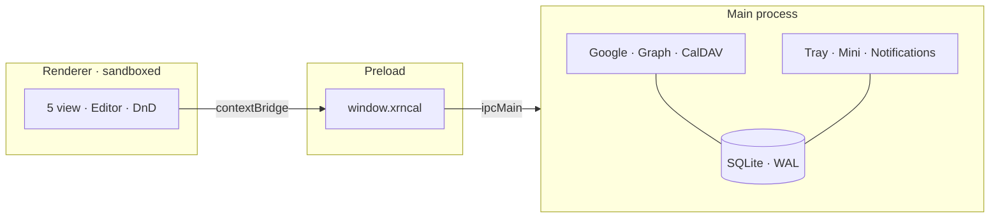

<p align="center">
  
</p>

<h1 align="center">xrncal</h1>

<p align="center">
  <strong>Lịch desktop local-first cho Windows và Linux.</strong><br>
  Google, Microsoft 365 và CalDAV trong một cửa sổ — kèm <em>lịch âm</em> và <em>giỗ theo năm âm</em>.
</p>

<p align="center">
  
  
  
  
  
  
</p>

<p align="center">
  
</p>

<p align="center">
  <a href="#khác-gì-với-app-lịch-thường">Khác gì?</a> ·
  <a href="#ảnh-màn-hình">Ảnh màn hình</a> ·
  <a href="#cài-đặt">Cài đặt</a> ·
  <a href="#tính-năng">Tính năng</a> ·
  <a href="#kiến-trúc">Kiến trúc</a> ·
  <a href="#phát-triển">Phát triển</a>
</p>

---

## Khác gì với app lịch thường

Phần lớn app lịch là **client của một dịch vụ**, hoặc là **tab web đóng gói lại**. xrncal đi hướng khác: dữ liệu nằm trong SQLite trên máy bạn, các provider chỉ là nơi đẩy đi / kéo về.

### 1. Âm lịch là công dân hạng nhất, không phải plugin

Đây là lý do app này tồn tại.

- Nhãn âm lịch hiện trên **mọi view** — ô ngày trong Tháng, header Tuần, nhóm ngày trong Danh sách. Mùng 1 âm được tô riêng.
- **Giỗ / ngày âm lặp hằng năm** là một loại sự kiện thật sự: bạn khai báo *"12 tháng 8 âm"*, app tự giải ra ngày dương cho **từng năm**, xử lý cả tháng nhuận và tháng thiếu 29 ngày.
- Google Calendar / Outlook / Apple Calendar không có quy tắc lặp theo lịch âm. Cách duy nhất ở đó là tự tra rồi tạo tay từng năm một — sai một năm là trượt cả chuỗi.
- Giỗ được **materialize** thành sự kiện thường trong lịch có sync, nên điện thoại và đồng nghiệp vẫn thấy, dù họ không dùng xrncal.

### 2. Offline là mặc định, không phải chế độ dự phòng

SQLite là **nguồn sự thật cho UI**. Mất mạng vẫn xem, vẫn tạo, vẫn sửa, vẫn xoá; sửa đổi được đánh `dirty = 1` và đẩy lên khi có mạng trở lại. Không có màn hình "không kết nối được".

### 3. Ba nhà cung cấp, một cửa sổ, không ưu tiên ai

Google Calendar, Microsoft 365 / Outlook.com và CalDAV (Nextcloud, Synology, generic) chạy **song song**, mỗi engine có `.catch` riêng — một provider hỏng không chặn hai cái còn lại.

### 4. Xung đột được nói thẳng, không ghi đè im lặng

Mọi update/delete đều gửi kèm precondition `If-Match`. Máy chủ trả `412` nghĩa là bản trên đó đã đổi: hàng đó được đánh dấu xung đột, **loại khỏi hàng đợi đẩy** và hiện ra để bạn chọn — thay vì thử lại rồi thất bại mãi mãi, hoặc đè mất thay đổi của người khác.

### 5. Token nằm trong OS secret store, và fail closed

OAuth token và mật khẩu CalDAV được mã hoá bằng Electron `safeStorage`. Trên Linux không có keyring, app **từ chối lưu** và báo lỗi rõ ràng — không có đường lùi về plaintext. Không telemetry, không tài khoản xrncal, không máy chủ trung gian.

### 6. View viết tay, thao tác bằng chuột đúng nghĩa

Năm view đều là component React tự viết, không dùng thư viện lịch bên thứ ba: kéo-thả, resize mép sự kiện, chọn khoảng thời gian bằng cách quét chuột, bước snap (15 / 30 / 60 phút) chỉnh được trong Settings. Kéo sang lịch khác thì hỏi *Move hay Copy* — và chỉ hỏi khi thao tác thật sự nhập nhằng.

|  | Lịch phổ thông | xrncal |
| --- | --- | --- |
| Âm lịch | Không, hoặc chỉ là nhãn phụ | Trên mọi view + lặp theo năm âm |
| Dữ liệu | Trên máy chủ dịch vụ | SQLite trên máy bạn |
| Offline | Xem là chính | Đọc, ghi, sửa, xoá đầy đủ |
| Nhiều tài khoản | Mỗi dịch vụ một app / một tab | Google + Graph + CalDAV cùng lúc |
| Xung đột sync | Thường là last-write-wins âm thầm | `If-Match` → đánh dấu 412 → bạn quyết |
| Lịch chỉ đọc | Tuỳ UI chặn | Chặn ở tầng repo, không bypass được |

---

## Ảnh màn hình

<table>
<tr>
<td width="50%" valign="top">

<p align="center"><sub><strong>Tuần</strong> — theme sáng, cột số tuần, vạch giờ hiện tại</sub></p>
</td>
<td width="50%" valign="top">

<p align="center"><sub><strong>Danh sách</strong> — gom theo ngày, kèm ngày âm bên phải</sub></p>
</td>
</tr>
<tr>
<td width="50%" valign="top">

<p align="center"><sub><strong>Editor</strong> — lịch, cả ngày, địa điểm, link họp, khách mời, lặp lại</sub></p>
</td>
<td width="50%" valign="top">

<p align="center"><sub><strong>Tìm kiếm</strong> — FTS5, có dấu tiếng Việt, mở bằng <code>/</code></sub></p>
</td>
</tr>
</table>

<sub>Ảnh chụp từ bản build thật với dữ liệu mẫu.</sub>

---

## Cài đặt

Yêu cầu build: **Node.js 20+** và Git. Chưa có bản release dựng sẵn — hiện tại build từ nguồn.

```bash
git clone https://github.com/Xernnn/xrncal-desktop.git
cd xrncal-desktop
npm install
```

### Linux — cài thành app bấm được từ menu

```bash
npm run app:install
```

Lệnh này build AppImage, đặt vào `~/Applications/xrncal.AppImage`, tạo launcher ở `~/.local/share/applications/xrncal.desktop` rồi refresh menu. Tìm "xrncal" trong app menu là ra. Chạy lại chính lệnh đó mỗi khi muốn cập nhật — nó ghi đè đúng các đường dẫn cũ, và ghi bằng cách `rename` nên **không làm hỏng app đang chạy** (bản đang mở vẫn dùng bản cũ cho tới khi bạn thoát và mở lại).

Muốn tự cầm file AppImage:

```bash
npm run pack:linux     # -> dist/*.AppImage
chmod +x dist/xrncal-*.AppImage
./dist/xrncal-*.AppImage
```

### Windows

```bash
npm run pack:win       # -> dist/  (NSIS installer, x64)
```

Chạy file `.exe` trong `dist/` để cài. Không có bản macOS.

### Chạy thẳng bản dev

```bash
npm run dev            # electron-vite, renderer hot-reload
```

### Kết nối tài khoản

CalDAV (Nextcloud, Synology, …) chỉ cần URL + tài khoản, **không cần cấu hình gì thêm**.

Google và Microsoft cần OAuth client **của chính bạn** — app không đóng gói sẵn client secret. Chép [`.env.example`](.env.example) thành `.env` rồi điền:

```ini
GOOGLE_OAUTH_CLIENT_ID=
GOOGLE_OAUTH_CLIENT_SECRET=
MICROSOFT_CLIENT_ID=
MICROSOFT_CLIENT_SECRET=
```

Với bản đã đóng gói, đặt cùng nội dung đó vào `xrncal.env` trong thư mục dữ liệu (xem bên dưới). Chưa điền thì nút kết nối Google / Microsoft bị tắt và app chạy hoàn toàn local — đó là hành vi đúng, không phải lỗi. Chi tiết đăng ký OAuth: [`docs/deployment-guide.md`](docs/deployment-guide.md).

### Dữ liệu nằm ở đâu

| Hệ | Đường dẫn |
| --- | --- |
| Linux | `~/.config/xrncal/xrncal.sqlite` |
| Windows | `%APPDATA%\xrncal\xrncal.sqlite` |

Sao lưu bất cứ lúc nào bằng **Settings → Sao lưu cơ sở dữ liệu** (ghi ra một file `.sqlite` mở được bằng bất kỳ công cụ SQLite nào).

> Nâng cấp từ bản **Gone Calendar** cũ: lần chạy đầu tiên xrncal tự chép dữ liệu từ `gone-calendar` sang. Profile cũ vẫn được giữ nguyên tại chỗ.

---

## Tính năng

<table>
<tr>
<td width="50%" valign="top">

**Lịch**
- 5 view: Ngày, Tuần, Tháng, Năm, Danh sách
- Kéo-thả, resize mép, quét chọn khoảng giờ
- Bước snap 15 / 30 / 60 phút
- Lặp lại: lần này / từ đây trở đi / cả chuỗi
- Sự kiện nhiều ngày, cả ngày, số tuần ISO
- Cột giờ múi thứ hai cho lịch xuyên quốc gia

</td>
<td width="50%" valign="top">

**Việt Nam & ngôn ngữ**
- Âm lịch trên Tháng / Tuần / Danh sách
- Giỗ lặp theo năm âm, xử lý tháng nhuận
- Lịch lễ Việt Nam và quốc tế, subscribe 1 cú bấm
- Giao diện tiếng Việt và English

</td>
</tr>
<tr>
<td width="50%" valign="top">

**Đồng bộ**
- Google Calendar (OAuth loopback + PKCE)
- Microsoft 365 / Outlook.com (Graph)
- CalDAV: Nextcloud, Synology, generic
- Sửa một lần xuất hiện cũng được đẩy lên đúng
- Poll thích ứng: 20s khi đang dùng, 5 phút khi blur
- Bảng xử lý xung đột 412

</td>
<td width="50%" valign="top">

**Chỗ làm việc**
- Cửa sổ mini luôn-trên-cùng từ khay hệ thống
- Thông báo nhắc trước giờ (Windows / Linux)
- Theme sáng / tối / theo hệ thống, ảnh nền tuỳ chỉnh
- Tìm kiếm FTS5, gợi ý tiêu đề từ lịch sử của bạn
- Nhập / xuất `.ics`, sao lưu database
- Gỡ tài khoản mà vẫn giữ lại sự kiện

</td>
</tr>
</table>

### Phím tắt

| Phím | Việc |
| --- | --- |
| `T` | Về hôm nay |
| `1` `2` `3` `4` `5` | Ngày · Tuần · Tháng · Năm · Danh sách |
| `N` hoặc `C` | Tạo sự kiện |
| `Ctrl+K` hoặc `/` | Tìm kiếm |
| `?` hoặc `F1` | Bảng phím tắt |

---

## Kiến trúc



| Tầng | Thư mục | Việc |
| --- | --- | --- |
| Renderer | `src/renderer` | React 19, 5 view, editor, i18n, theme |
| Preload | `src/preload` | `window.xrncal` có type, sandbox bật |
| Main | `src/main` | SQLite, OAuth, sync, tray, thông báo |
| Shared | `src/shared` | `CalendarEvent`, `XrncalAPI`, âm lịch, ngày lễ |

Renderer **không bao giờ** import `src/main`; IPC là cây cầu duy nhất, và mọi channel được khai báo tập trung trong `src/shared/ipc-contract.ts`. Lịch chỉ đọc (ngày lễ) bị chặn ghi ngay ở tầng repo, không phải ở UI.

---

## Phát triển

```bash
npm run dev            # chạy app, hot-reload renderer
npm run typecheck      # tsc cho main + renderer (chạy trước khi commit)
npm run lint           # ESLint 9 flat config
npm run test           # Vitest — chạy trong Node, không cần Electron binary
npm run build          # bundle production -> out/
```

Chạy một file test: `npx vitest run tests/expand-occurrences.test.ts`. CI chạy lint + typecheck + test + build trên mọi push và PR.

| Tài liệu | Nội dung |
| --- | --- |
| [Architecture](docs/system-architecture.md) | Process, IPC, luồng dữ liệu |
| [Codebase](docs/codebase-summary.md) | Map thư mục và schema |
| [Standards](docs/code-standards.md) | Naming, quy ước, bảo mật |
| [Design](docs/design-guidelines.md) | Token màu, chrome, motion |
| [Deploy](docs/deployment-guide.md) | Build, đóng gói, đăng ký OAuth |
| [URD](docs/urd.md) · [PDR](docs/project-overview-pdr.md) · [Roadmap](docs/project-roadmap.md) | Phạm vi và quyết định sản phẩm |

---

## Giấy phép

[MIT](LICENSE) © Xernnn.

Dùng `ical.js` (MPL-2.0) và `rrule` (BSD-3-Clause); còn lại là MIT hoặc ISC. Không có phụ thuộc copyleft lây lan.

---

<p align="center">
  <sub>Electron · React · TypeScript · Tailwind · SQLite · Windows &amp; Linux</sub>
</p>
